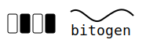

# Bitogen  
### A Symbolic Layer for Binary Data  
**Research Project • Experimental • Open for Collaboration**

<p align="left">
  
</p>

---

<p align="left">
  
  
  
  
</p>

---

## 🔍 Overview

**Bitogen** is a new conceptual framework for representing and processing binary data.  
It introduces **bitogens** — stable, predefined symbolic units that map to variable-length bit-patterns.

Bitogens allow:

- **better compression** (structured symbolic modeling)  
- **cryptographic preprocessing** (symbolic permutation before AEAD)  
- **AI-friendly tokenization** of any binary data  
- **structural insight** into arbitrary bitstreams  

This project aims to explore whether symbolic binary tokenization can open new directions in data compression, modeling, analysis, and secure preprocessing.

---

## 🧬 What is a Bitogen?

A **bitogen** is:

- a symbolic token (`B42`, `B7`, …)  
- mapped to a specific bit-pattern  
- defined in a global dictionary  
- fully reversible  
- usable in compression, cryptography, and machine learning  

### Example

```
B1 → 01
B2 → 110
B3 → 0001
```

Bitogenization:

```
Raw: 011000010110...
Tok: B1 B2 B3 B1 ...
```

---

## 🌐 Why This Project Matters

- Current binary compressors operate on bytes or bits with limited structure.  
- Cryptographic preprocessing rarely operates above the bit/byte level.  
- AI models struggle with raw binary streams.  

**Bitogens introduce a universal symbolic layer**, allowing:  
✔ structured analysis  
✔ symbolic cryptographic transformations  
✔ learned compression on tokens  
✔ domain-specific optimizations  

---

## 🧱 Repository Structure

```
bitogen/
├── README.md
├── LICENSE
├── docs/
│   ├── Bitogen_Overview_Documentation.md
│   ├── Bitogen_Cipher_Spec.md
│   ├── Bitogen_Compression_Notes.md
│   ├── Bitogen_Dictionary_Examples.md
│   ├── bitogen_whitepaper_scientific.pdf
│   ├── bitogen_concept_en.pdf
│   └── bitogen_conversation_fragment.pdf
├── roadmap/
│   └── ROADMAP.md
├── logo/
│   └── bitogen_logo.svg
└── (future) src/, prototypes/, examples/
```

---

## 🔐 Hybrid Bitogen Cipher (High-Level)

```
bitstream
   ↓
bitogenization
   ↓
keyed permutation of symbols
   ↓
(optional) symbolic stream mixing
   ↓
AES-GCM / ChaCha20-Poly1305 (AEAD)
```

The AEAD layer provides cryptographic security.  
The bitogen layer provides **structural obfuscation**.

---

## 🗜️ Compression Pipeline

1. Bitstream → bitogens  
2. Token sequence → statistical/AI model  
3. Model outputs probabilities  
4. Arithmetic/ANS coding  
5. Output compressed file  

---

## 📚 Documentation

### Core
- `docs/Bitogen_Overview_Documentation.md` – concept overview  

### Scientific
- `docs/bitogen_whitepaper_scientific.pdf` – academic-style document  

### Technical
- `docs/Bitogen_Cipher_Spec.md`  
- `docs/Bitogen_Compression_Notes.md`  
- `docs/Bitogen_Dictionary_Examples.md`  

---

## 🧭 Project Roadmap
See: `roadmap/ROADMAP.md`

---

## 👤 Author

**Marek Walczak**  
Creator & original author of the Bitogen concept.

Authorship is permanently preserved under the MIT License.

---

## 💼 Commercial & Research Inquiries

The Bitogen project is open-source, but commercial collaboration is possible.

Available for:

- Research partnerships  
- Consulting (compression, cryptography, AI preprocessing)  
- Joint experiments  
- Implementation work  
- Commercial integrations  

📩 Contact: *(insert your preferred email)*

---

## 🧑‍🔬 Status

**Early-stage research. Not production-ready.**  
Seeking contributors, cryptographers, compression engineers, and ML researchers.

---

## 📜 License

Released under the **MIT License**.  
Commercial use is allowed.  
Authorship must be preserved.

---

## 🤝 Contributions

Contributions, discussions, and reviews are welcome.  
Open an Issue or PR to start a conversation.
